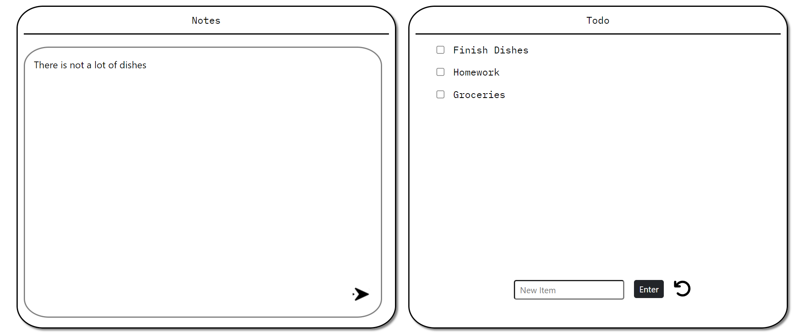
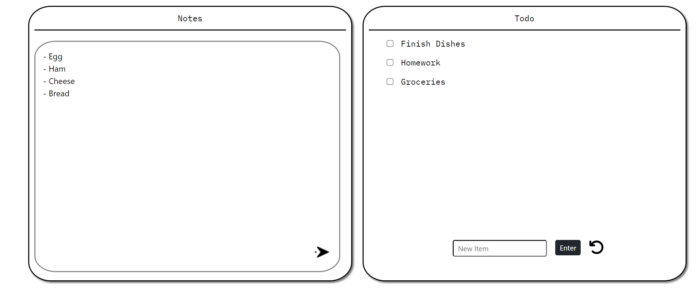

<!-- PROJECT LOGO -->
 

  <h3 align="center">TodoList</h3>

<!-- ABOUT THE PROJECT -->
## About The Project
The purpose of this project, was to create somthing simple that helped me explore the world of Full Stack. Before this project my knowledge about HTML, CSS, and JavaScript was little to none. In order to learn efficiently, I decided to create a TodoList website. A todo list website might not be as significant; however, the knowledge I gained from this project was. Im not an expert, for sure, but now I know the basics of Full Stack which I can use to create future projects. Fell free to implement the project and add new features. 

I hope you enjoy and thank you.

(<a href="#readme-top">back to top</a>)

### Built With

* JQuery
* BootStrop
* CSS
* HTML
* EJS
* Node.JS
* JavaScript

(<a href="#readme-top">back to top</a>)

<!-- USAGE EXAMPLES -->
## Usage

  
  

This todo list app allows the user to add an item and add a note with the item as well. This note can be updated and edited when the user selects the item. 

(<a href="#readme-top">back to top</a>)

<!-- CONTACT -->
## Contact

Jose Jimenez - [LinkedIn](https://www.linkedin.com/in/jose-angel-jimenez-537421290/) - joseangel130414@gmail.com

Project Link: [TodoList](https://github.com/JJimenez414/todoList)

(<a href="#readme-top">back to top</a>)

<!-- MARKDOWN LINKS & IMAGES -->
<!-- https://www.markdownguide.org/basic-syntax/#reference-style-links -->
[contributors-shield]: https://img.shields.io/github/contributors/othneildrew/Best-README-Template.svg?style=for-the-badge
[contributors-url]: https://github.com/othneildrew/Best-README-Template/graphs/contributors
[forks-shield]: https://img.shields.io/github/forks/othneildrew/Best-README-Template.svg?style=for-the-badge
[forks-url]: https://github.com/othneildrew/Best-README-Template/network/members
[stars-shield]: https://img.shields.io/github/stars/othneildrew/Best-README-Template.svg?style=for-the-badge
[stars-url]: https://github.com/othneildrew/Best-README-Template/stargazers
[issues-shield]: https://img.shields.io/github/issues/othneildrew/Best-README-Template.svg?style=for-the-badge
[issues-url]: https://github.com/othneildrew/Best-README-Template/issues
[license-shield]: https://img.shields.io/github/license/othneildrew/Best-README-Template.svg?style=for-the-badge
[license-url]: https://github.com/othneildrew/Best-README-Template/blob/master/LICENSE.txt
[linkedin-shield]: https://img.shields.io/badge/-LinkedIn-black.svg?style=for-the-badge&logo=linkedin&colorB=555
[linkedin-url]: https://linkedin.com/in/othneildrew
[product-screenshot]: images/screenshot.png
[Next.js]: https://img.shields.io/badge/next.js-000000?style=for-the-badge&logo=nextdotjs&logoColor=white
[Next-url]: https://nextjs.org/
[React.js]: https://img.shields.io/badge/React-20232A?style=for-the-badge&logo=react&logoColor=61DAFB
[React-url]: https://reactjs.org/
[Vue.js]: https://img.shields.io/badge/Vue.js-35495E?style=for-the-badge&logo=vuedotjs&logoColor=4FC08D
[Vue-url]: https://vuejs.org/
[Angular.io]: https://img.shields.io/badge/Angular-DD0031?style=for-the-badge&logo=angular&logoColor=white
[Angular-url]: https://angular.io/
[Svelte.dev]: https://img.shields.io/badge/Svelte-4A4A55?style=for-the-badge&logo=svelte&logoColor=FF3E00
[Svelte-url]: https://svelte.dev/
[Laravel.com]: https://img.shields.io/badge/Laravel-FF2D20?style=for-the-badge&logo=laravel&logoColor=white
[Laravel-url]: https://laravel.com
[Bootstrap.com]: https://img.shields.io/badge/Bootstrap-563D7C?style=for-the-badge&logo=bootstrap&logoColor=white
[Bootstrap-url]: https://getbootstrap.com
[JQuery.com]: https://img.shields.io/badge/jQuery-0769AD?style=for-the-badge&logo=jquery&logoColor=white
[JQuery-url]: https://jquery.com 
